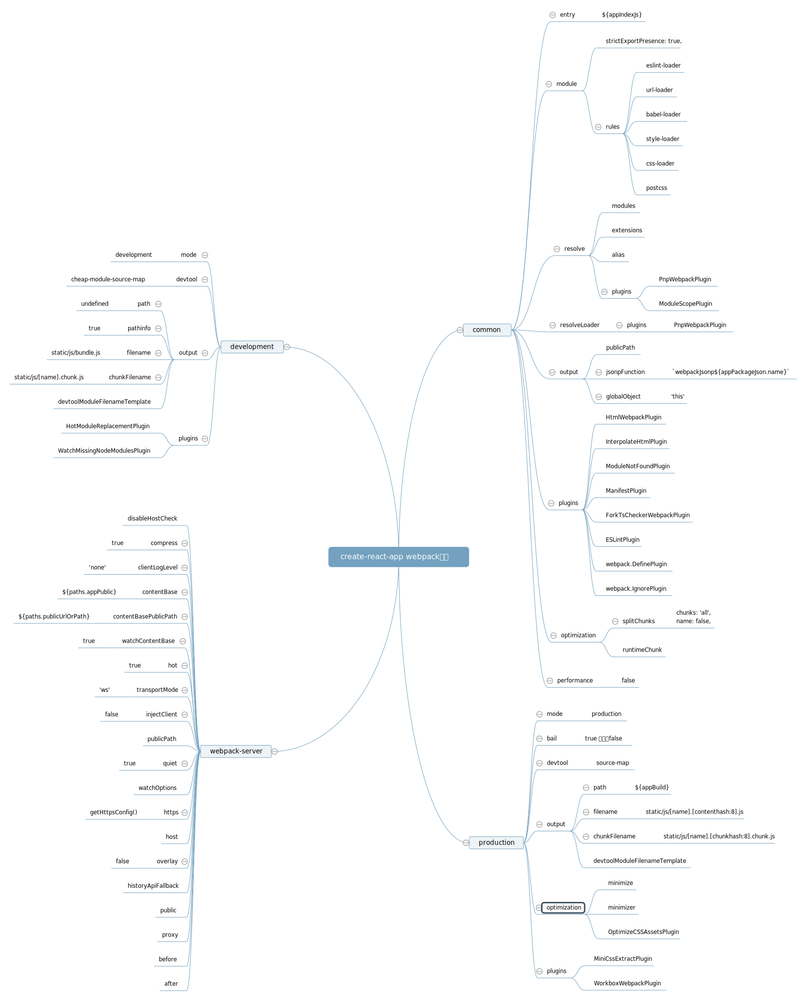

# creactReactApp webapck 配置分析

`creactReactApp`是最流行的`React`脚手架工具,可以满足各种不同的需求项目的开发和打包， 通过阅读学习`creactReactApp`这种脚手架项目`webpack`配置，可以更多的了解到关于`webpack`的一些细节和深层次的东西，并且学会了如何配置大型项目的`wepbapck`。

执行`npm run eject`之后目录生成`scripts`和`config`两个文件家，`scripts`文件夹包含`npm`命令文件，`config`文件夹则是`webpack`配置相关的文件。

